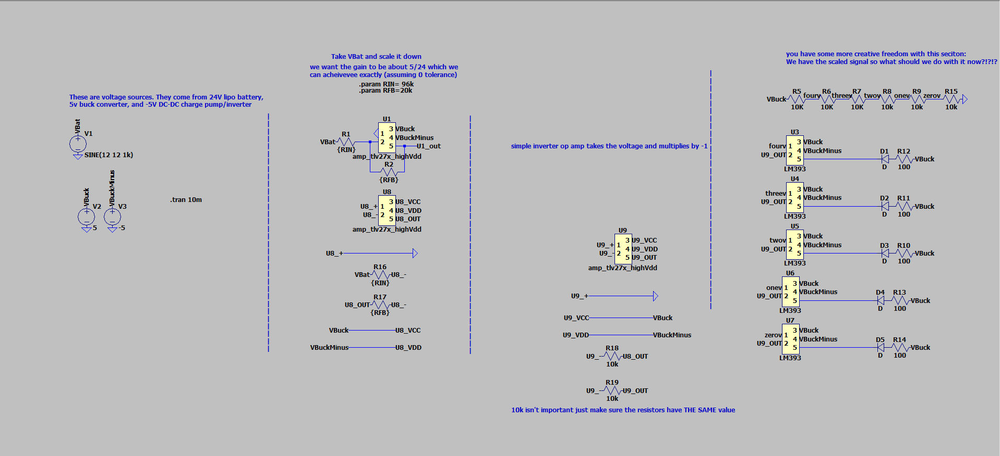

### what does the battery monitor board do???

Not much! It monitors the batteries voltage and will blink an indicator when the 
battery gets too low (so we can change/re-charge it)

It might be worth adding temperature sensors/monitors as a feature in the future.
I don't think overheating is really an issue but idrk.

### what does the battery monitor board look like in LTSpice

A mess!

Here's an image of the LTSpice schematic

#### how it works

- left most thing
    - the leftmost thing is VBat (24V)
    - it's also +5V and -5V (you get them from a buck converter or something)
- second to the left is an op-amp circuit
    - this op-amp has a gain of ~$\frac{5}{24}$
    - this has the annoying side affect of inverting the signal
- inverting stage
    - literally just an op-amp that (un)inverts the signal 
- output stage
    - what should we do???
    - Depends:
        - led indicator
        - digital signal for PI or uP
        - analog voltage that indicates strength of battery

# TODOS

lowk this spice sim assumes that the battery can vary from
0-24V which is 100% cap!

the battery can vary between 22.4V and 24V

22.4V is 0%
24V is 100% 

(and everything in between is linear)