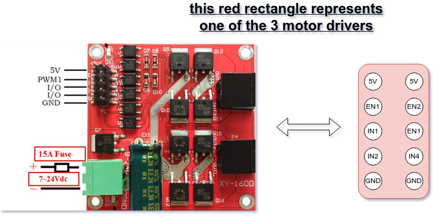
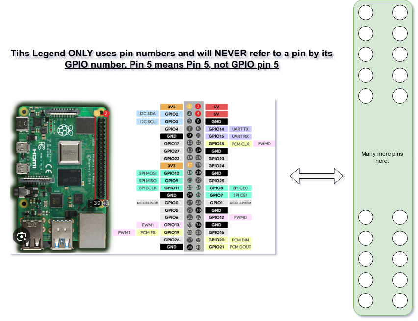
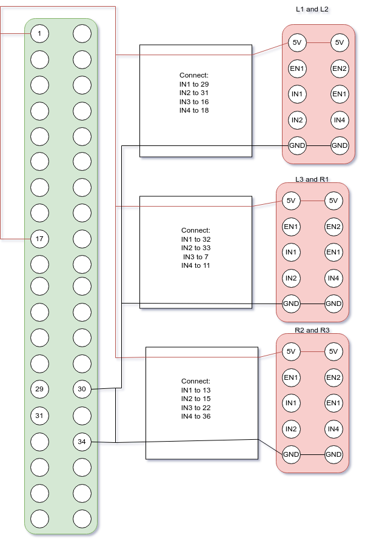

# Pi hat and motor hats super cool

We'll end up with 4 hats (one for the PI, one for each motor driver).

While EN1 and EN2 aren't routed to anything on the Pi-hat, they should still be input/output from the motor hat

# Here's a motor legend

# Here's a Pi legend

# Here's the general wiring spec (you'll make 4 hats and these will be the connections in-between them)

EN1 and EN2 aren't connected to the PI hat but should still be exposed by the hats (just like every other pin)